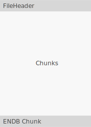

# File Structure

1. [File Structure](#file-structure)
   1. [Header](#header)
   2. [Chunks](#chunks)
   3. [Reserved Codes](#reserved-codes)

The file format is a simple chunk based format. It is comprised of a 12-byte file header followed by any number of chunks. The last chunk should be a blank chunk header with the ENDB code.



A complete chunk includes a header and a data block. The length of the data block and its type are stored in the header. 

The chunk header is a varying sized structure that is 20 or 24 bytes. The chunk size is dependent on the platform architecture where the file was saved. 


## Header

The file header is the first 12 bytes of the file. It is used to determine the file type, the platform it was saved in and the API version.

| Bytes  | Data Type | Description                                                                 |
| :----: | --------- | :-------------------------------------------------------------------------- |
| [0,6]  | char[7]   | Are a unique name to identify the file type.                                |
|   7    | char      | Identifies the machine architecture that the file was was saved in.         |
|   8    | char      | Identifies the byte order that the file was was saved in.                   |
| [9,12] | int       | A integer that fills up to 3 ASCII characters; IE, version 1.5.0 equals 150 |

Codes for bytes 7,8

| ASCII | Hex  | Description                                                    |
| ----- | ---- | -------------------------------------------------------------- |
| '-'   | 0x2D | '-' indicates that the file was saved with 64 bit chunks.      |
| '_'   | 0x5F | '_' indicates that the file was saved with 32 bit chunks.      |
| 'V'   | 0x56 | 'V' indicates that the file was saved on a big endian machine. |
| 'v'   | 0x76 | 'V' indicates that the file was saved on a big endian machine. |

## Chunks


```c++
struct ChunkNative
{
    unsigned int code;    // 4 bytes
    unsigned int length;  // 4 bytes
    size_t       address; // 4|8 bytes
    unsigned int typeid;  // 4 bytes
    unsigned int count;   // 4 bytes
}; // 20 or 24 bytes total
```

The address member needs to be large enough to hold the base address of the pointer that this chunk represents.

```c++
struct Chunk32
{
    unsigned int code;    // 4 bytes
    unsigned int length;  // 4 bytes
    unsigned int address; // 4 bytes
    unsigned int typeid;  // 4 bytes
    unsigned int count;   // 4 bytes
}; // 20 bytes total
```

```c++
struct Chunk64
{
    unsigned int      code;    // 4 bytes
    unsigned int      length;  // 4 bytes
    unsigned int64_t  address; // 8 bytes
    unsigned int      typeid;  // 4 bytes
    unsigned int      count;   // 4 bytes
}; // 24 bytes total
```

```
Chunk32
Code   : OLIB
Len    : 152
Old    : 0x15170d0
TypeId : 0
Count  : 1
-------------------------------------------------------------------------------
00000000   43 75 62 65 00 00 00 00  00 00 00 00 00 00 00 00  |Cube............|
00000010   00 00 00 00 00 00 00 00  00 00 00 00 00 00 00 00  |................|
00000020   00 00 00 00 00 00 00 00  00 00 00 00 00 00 00 00  |................|
00000030   00 00 00 00 00 00 00 00  00 00 00 00 00 00 00 00  |................|
00000040   00 00 00 00 00 00 00 00  00 00 00 00 00 00 00 00  |................|
00000050   00 00 00 00 00 00 00 00  00 00 00 00 00 00 00 00  |................|
00000060   00 00 00 00 00 00 00 00  00 00 00 00 00 00 00 00  |................|
00000070   00 00 00 00 63 58 E2 3F  00 00 00 00 63 58 E2 3F  |....cX.?....cX.?|
00000080   00 00 00 00 63 58 E2 3F  02 00 00 00 50 41 44 42  |....cX.?....PADB|
00000090   68 09 B9 01 CD CD CD CD                           |h.......        |
-------------------------------------------------------------------------------

```


| Member  | Description                                                                          |
| ------- | :----------------------------------------------------------------------------------- |
| code    | Is a unique IFF type identifier for identifying how this block should be read.       |
| length  | Is the size in bytes of the chunks data.                                             |
| address | Is the base address of the chunk data at the time of saving.                         |
| typeid  | Is the structure type index identifier found in the DNA1 block.                      |
| count   | Is the number of subsequent blocks being saved in this chunk starting with 'address' |

## Reserved Codes

The following are reserved chunk identifiers that are used to build the API.  

| Member | Description                                                                                                                      |
| ------ | :------------------------------------------------------------------------------------------------------------------------------- |
| DNA1   | Chunk identifier that lets the loader separate and load the API.                                                                 |
| SDNA   | Table header.                                                                                                                    |
| NAME   | Specifies the member name table.                                                                                                 |
| TYPE   | Specifies the type name table.                                                                                                   |
| TLEN   | Specifies the type length table.                                                                                                 |
| STRC   | Specifies the structure table.                                                                                                   |
| DATA   | Indicates a block of data that may or may not have a structure associated with it but still needs to be relinked by its address. |

See the [TableStructure](TableStructure.md) document for a description of their use.
